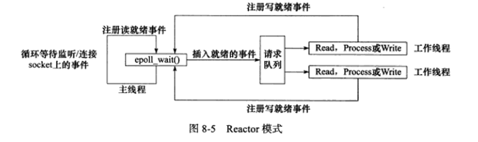

## Reactor模式： 
要求主线程只负责监听文件描述符上是否有事件发生，有的话就立即将该事件通知工作线程。
除此之外，主线程不做任何其他实质性的工作。读写数据，接受新的连接，以及处理客户请求
均在主线程中完成。

### 使用同步I/O模型(以epoll_wait为例)实现的Reactor模式的工作流程是：
1. 主线程往 epoll 内核事件表中注册 socket 上的读就绪事件。
2. 主线程调用 epoll_wait 等待 socket 上有数据可读。
3. 当 socket 上有数据可读时， epoll_wait 通知主线程。主线程则将
    socket 可读事件放入请求队列。
4. 睡眠在请求队列上的某个工作线程被唤醒， 它从socket读取数据，并处理客户请求，
    然后网epoll内核事件表中注册该socket上的写就绪事件。
5. 当主线程调用epoll_wait等待socket可写。
6. 当socket可写时，epoll_wait 通知主线程。主线程将socket可写事件放入请求队列。
7. 睡眠在请求队列上的某个工作线程被唤醒， 它往socket上写入服务其处理客户请求的结果。

图8-5中，工作线程从请求队列中取出事件后，将根据事件的类型来决定如何处理它：
    对于可读事件，执行读数据和处理请求的操作；
    对于可写事件，执行写数据的操作。因此，
图 8-5 所示的 Reactor 模式中，没必要区分所谓的“读工作线程” 和 “写工作线程”